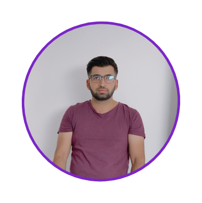
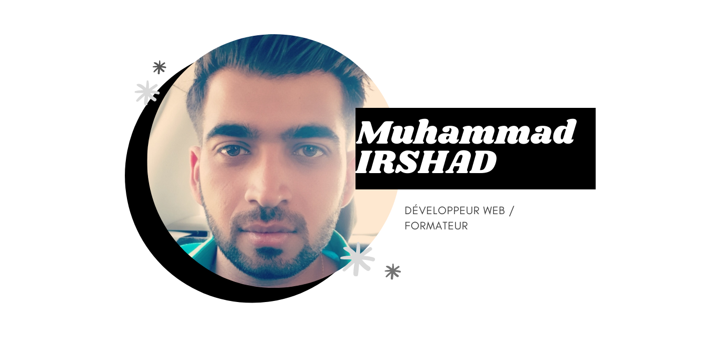

### Hey 👋, I'm [Muhammad IRSHAD !](https://github.com/kashifir)

 

&nbsp;\
 <a href="https://irshadmuhammad.fr/" align="left" > My portfolio : irshadmuhammad.fr </a> 

Always passionate about new technologies and the internet, I decided in 2014 to make it my job. For this, I studied web development (Back-end and Front-end) for 3 years. After graduating, I joined a Start Up as a full-stack web developer, then another the following year as CTO.

After several years of activity and projects under my belt, I wanted to become independent. It was therefore in September 2018 that I started freelancing in order to be able to intervene in a greater number of fields of activity.

These different professional experiences have allowed me to better understand the expectations of a client, to know how to be proactive and to respond precisely to the required needs.

In September 2019, I decided to take a new turn in my professional career by becoming a web trainer. I have been teaching web technologies to students without a diploma and people in retraining. This new activity allowed me to acquire new skills such as pedagogy, group management, support and evaluation.

 

**Skills:**

&nbsp;
&nbsp;
&nbsp;
&nbsp;
&nbsp;
&nbsp;
&nbsp;

&nbsp;
&nbsp;
&nbsp;
&nbsp;
&nbsp;

&nbsp;
&nbsp;

&nbsp;
&nbsp;
&nbsp;
&nbsp;

&nbsp;
&nbsp;
&nbsp;
&nbsp;

&nbsp;
&nbsp;

&nbsp;

&nbsp;

&nbsp;
&nbsp;

&nbsp;
&nbsp;

### My Projects :

&nbsp;

&nbsp;

### Most Tops Langs

 
&nbsp;
&nbsp;

 

&nbsp;
&nbsp;&nbsp;
&nbsp;&nbsp;
&nbsp;

- 💬 Ask me about anything, I am happy to help
- 📫 How to reach me: conatct@irshadmuhammad.fr

&nbsp;

-----

Credits: [Muhammad IRSHAD](https://github.com/kashifir)

Last Edited on: 07/09/2021
